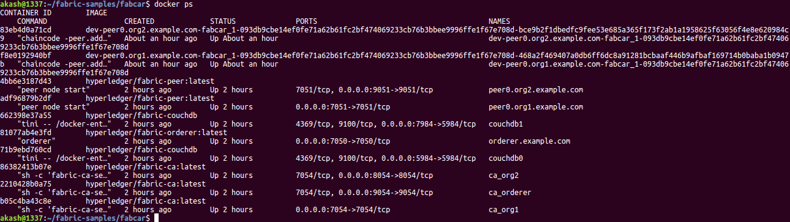

Hello there mates. Hope everyone's safe out there. This is Akash, working as Systems Engineer in TCS where I do Security Analysis for applications. Keeping that aside, I am a blockchain developer working on Hyperledger Fabric and Sawtooth.

We all know Hyperledger Fabric has a complex architecture. Here is a fun fact, it is simple to control with the tools available.Internally it has a good security and privacy with channels, policies, many more which fits it for enterprise Blockchain usecases. On the other hand, externally it requires a lot of effort to deal with the security aspects of the network which include a firewall protection, maintaining whitelisted domains to deal with APIs, security to the docker containers and so on. But point is hackers are smart enough to find a way to exploit and get access to anything. There are gazzilion ways in which a hacker can compromise a server. If a server is having a participant of fabric network, it could be a peer, orderer, couchDB etc., and if compromised, it results in a great loss to the business. In this article I would like to show how one can extract data from fabric ledger without being a user or admin.

### SETUP

For this article I made use of fabcar that is part of fabric-samples provided by hyperledger fabric. In this fabcar chaincode, we have a 'InitLedger' function which will invoke before a user can make use of it. It will initialise ledger with some data. It is this data that will be at stake. Let's clear the network and remove stopped containers, prune the docker volume and network so that there wont be any hurdles in the process. To perform this, execute below script in fabcar directory.

```sh
$ ./networkDown.sh
```

Next lets start the network

```sh
$ ./startFabric.sh
```

By the time the script excecutes, you can see the running containers as shown.



Now if you refer the docker-compose file of peers and orderer you can see a volume mounted as orderer.example.com:/var/hyperledger/production/orderer in orderer and peer0.org1.example.com:/var/hyperledger/production in peer. Lets take a peek at what's inside those paths.

### IN PEER VOLUME

In peers, ledger data gets stored in /var/hyperledger/production. production folder has 5 subfolders: **chaincodes**, **externalbuilder**, **ledgersData**, **lifecycle**, **transientStore**. Inside ledgersData we have six folders: **bookkeeper**, **chains**, **configHistory**, **couchdbRedoLogs**, **fileLock**, **historyLeveldb**, **ledgerProvider**, **pvtdataStore**. Inside chains we have two other folders: **chains**, **index**. chains folder has all the channel data, a folder with name mychannel will have complete ledger data of that channel in file **blockfile_000000**.

```
.   .
│   ├── chains
│   │   ├── chains
│   │   │   └── mychannel
│   │   │       └── blockfile_000000
.   .   .
```

### IN ORDERER VOLUME

In orderer, ledger data gets stored in /var/hyperledger/production/orderer folder. orderer has 3 folders: **chains**, **etcdraft**, **index**. chains has folders with name of channel and system-channel. All the folders have blockfile_000000. The **blockfile_000000** file in mychannel will have all the ledger data. If we have two or more channels, directories with their respective names will be created as it is orderer.
```
.
├── chains
│   ├── mychannel
│   │   └── blockfile_000000
│   └── system-channel
│       └── blockfile_000000
.
```
### DATA EXTRACTION

lets take blockfile_000000 from orderer. It can be seen that fabcar chaincode is using json.Marshal() function to convert data to bytes before writing data to ledger. I wrote a small code in js to extract json from a given string. Copying block file to our desired location and executing the js code will give us the json data that is present in ledger as you can see.
Here is the small piece of code that helps us extracting json from a given string.


```js
const fs = require('fs')
const extract = require('extract-json-from-string')
console.log(extract(fs.readFileSync(process.argv[2], "ascii")))
```
Here we are passing the file as a command line argument. Passing blockfile as input results following output.

```sh
$ node extract.js ./blockfile_000000
[ { make: 'Toyota',
    model: 'Prius',
    colour: 'blue',
    owner: 'Tomoko' },
  { make: 'Ford', model: 'Mustang', colour: 'red', owner: 'Brad' },
  { make: 'Hyundai',
    model: 'Tucson',
    colour: 'green',
    owner: 'Jin Soo' },
  { make: 'Volkswagen',
    model: 'Passat',
    colour: 'yellow',
    owner: 'Max' },
  { make: 'Tesla', model: 'S', colour: 'black', owner: 'Adriana' },
  { make: 'Peugeot',
    model: '205',
    colour: 'purple',
    owner: 'Michel' },
  { make: 'Chery', model: 'S22L', colour: 'white', owner: 'Aarav' },
  { make: 'Fiat', model: 'Punto', colour: 'violet', owner: 'Pari' },
  { make: 'Tata',
    model: 'Nano',
    colour: 'indigo',
    owner: 'Valeria' },
  { make: 'Holden',
    model: 'Barina',
    colour: 'brown',
    owner: 'Shotaro' } ]
```

Here we can see that the data we extracted is actually the one which we stored during initialising ledger. Eventhough I didn't enroll Admin or a user to invoke QueryAllCars function, I can visualize the data that is stored in ledger. If a hacker can compromise the server in which either a peer or an orderer is running, he can easily run his choice if he has a basic knowledge on fabric architecture. This may be very dangerous if it is a sensitive application.

### WHAT CAN WE DO?

I think you all have a clear idea about encryption and its advantages. Encryption can be one of many solutions to avoid unforeseen situations as mentioned in my article above. One can have a glance at [this](https://github.com/yeasy/docker-compose-files/blob/master/hyperledger_fabric/v2.1.0/examples/chaincode/go/enccc_example/utils.go) to get an idea on how to utilize encryption algorithms while implementing a chaincode. Ciphertext is hard to understand, making it impossible for one to extract cipher data. 

### CONCLUSION

This article conveys that data can be misused when certain measures are not taken. Many developers concentrate mostly on network and application development part but do not pay much attention when it comes to security criteria. This may not happen in the exact same way as mentioned but it doesn't cost you to be a little careful. In my coming blogs ill dig a little deeper about few more security insights.
